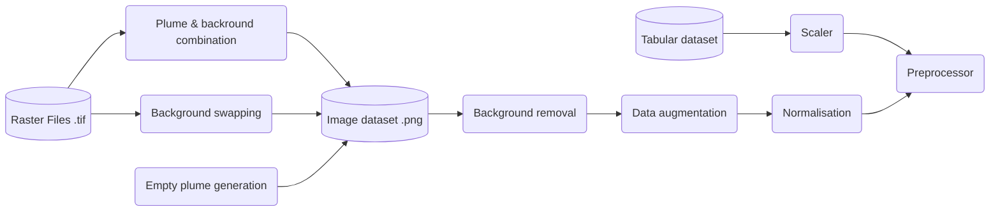
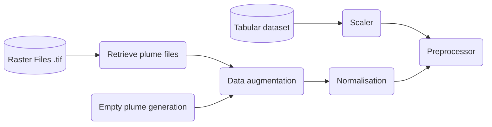
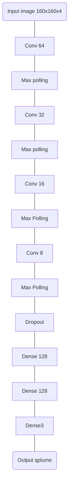

# Above_Methane_Emission
**Team Above Methane Emission** - Source repository for the **2023 Zeroing Methane Emissions Datathon**.

## About
This repository contains the  **data preprocessing** and **model training** notebooks for the quantitative part of the datathon.

### Objective
Given a set of aerial surveys data, predict the estimated methane emission rate of a source.

### Dataset

The dataset provided contains a dataframe with sources description and plume observations, including the plume emission rate `qplume` for each observation and the associated uncertainty `sigma qplume`. It also contains aerial images of the ground and of the plume, either separated as `tif` raster files, or combined as `png` files. 


## Workflow

If the test dataset is presented as png files, the prepocessing pipeline contains the following steps : 

- Creation of png images by combining the background and plume tif files.
- Augmentation of the dataset by swapping a background image with a plume. The labelled estimated rate is the one corresponding to the plume file.
- Data augmentation. As the color of the plume and it's size on the image are correlated with the ground truth emission rate, we cannot apply data augmentation on colors or size. Flips and rotations have been used instead. 
- Empty plume image generation. Emply images have been added to the dataset in order to expose the model to 0 values.
- Images and the target values normalisation / scaling.
- Preprocessing, entries having a relative uncertainty ${\sigma \over qplume}$ above a given threshold are filtered.



In case of test images as tif files, the pipeline is a bit simplified.



## Model

The model used is a simple convolutionnal network for regression, predicting an emission rate given an image as an input.


The model has been trained using `Adam` optimizer, `MSE` loss, for 50 epochs, with a learning rate of 0.005. Validation set is 25% of the train dataset. Test dataset is 10% of the whole dataset. Batch size of 128.


## Notebooks

The two notebooks in this repo contain the following functions : 

- Main model training and inference
- Dataset augmentation - png generation, background swapping, empty image generation
- Png image background removal - two approaches, either with manual value tuning, or RGB key search. 


## Run it

Runing a container docker with GPU support :
```bash
docker run -p 8888:8888 --gpus all -v /your/project/path:/tf/datathon tensorflow/tensorflow:latest-gpu-jupyter

``` 

## References


### Datathon 

- [SPE Untapped website](https://www.speuntapped.com/welcome)
- [Bootcamp 1 vidéo (54mn)](https://www.youtube.com/watch?v=RZiK9V-5bwE ) - context of the datathon

### Competition Dataset

http://tiny.cc/zerodata 

### Related Datasets 
- [Carbon mapper](https://carbonmapper.org/data/)
- [Permian Basin plume imagery (GeoTIFFs) and plume
emissions lists I](https://doi.org/10.5281/zenodo.5610307)
- [Permian Basin plume imagery (GeoTIFFs) and plume
emissions lists II](https://doi.org/10.1021/acs.estlett.1c00173)
- [Airborne plume imagery (GeoTIFFs) and plume emissions
lists](https://doi.org/10.5281/zenodo.5606120)


